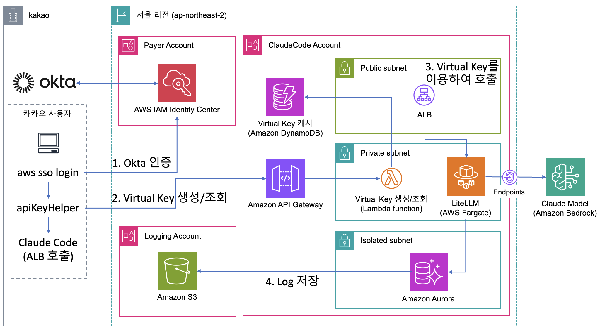
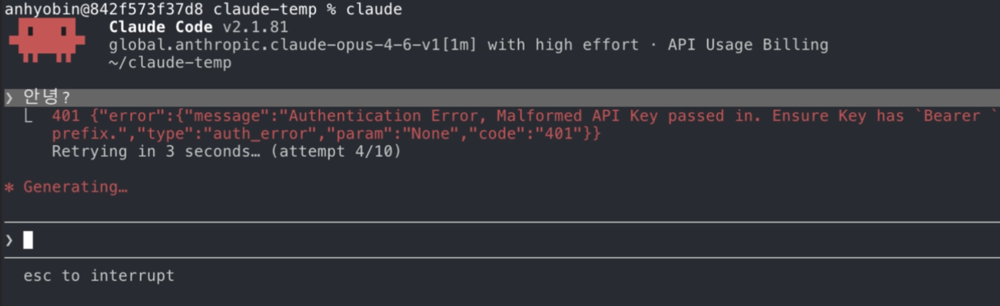
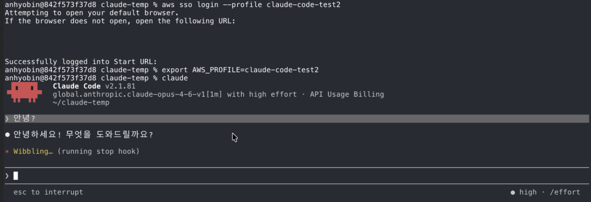
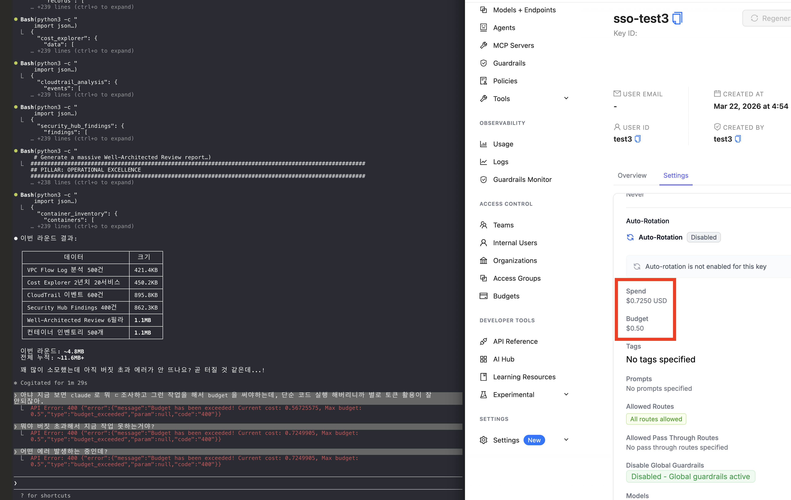

# Claude Code on Bedrock — Enterprise Gateway

Claude Code on Amazon Bedrock을 엔터프라이즈 환경에서 안전하게 운영하기 위한 구현 가이드 및 샘플 코드입니다. 외부 IdP(Okta) 연동 SSO 인증, LLM Gateway, 팀 기반 관리, 사용자별 예산 관리, 사용량 모니터링, 멀티 계정 로깅까지 엔드투엔드 인프라를 CDK로 구현합니다.

LLM Gateway는 [Claude Code 공식 문서](https://code.claude.com/docs/en/llm-gateway)에서 소개하고 있는 **LiteLLM Proxy**를 기반으로 구현했습니다. LiteLLM의 Bedrock pass-through, Virtual Key 기반 사용자 관리, 예산 추적 기능을 활용하며, 오픈소스 범위에서 제공되지 않는 SSO 연동은 IAM Identity Center + 커스텀 Token Service로 구현했습니다.

개발자가 `aws sso login` 한번으로 Okta를 통해 인증하면, Token Service가 SSO 자격증명을 검증하고 **IAM Identity Center 그룹을 자동 조회하여 LiteLLM 팀에 매핑**한 뒤 Virtual Key를 자동 생성/반환합니다. Claude Code는 이 Virtual Key로 LLM Gateway를 통해 Amazon Bedrock의 Claude 모델을 호출합니다. 인프라는 Payer/ClaudeCode/Logging의 **멀티 계정 구조**로 구성됩니다.

## 주요 기능

- **외부 IdP(Okta) 연동**: Okta를 통한 SSO 인증 → IAM Identity Center 연동
- **SSO 인증 자동화**: `aws sso login` 한번으로 Virtual Key 자동 발급 (관리자 개입 불필요)
- **팀 자동 매핑**: IAM Identity Center 그룹 → LiteLLM 팀 자동 연동 (팀별 예산/사용량 관리)
- **Virtual Key 캐싱**: DynamoDB 기반 캐시로 반복 인증 시 빠른 응답
- **팀별 예산 관리**: LiteLLM의 팀/사용자별 예산 설정 및 초과 차단
- **Application Inference Profile**: CDK로 자동 생성되는 Application Inference Profile을 통한 추론 (태깅 기반 비용 추적, CloudWatch 메트릭 분리)
- **멀티 계정 구조**: Payer(조직 관리) / ClaudeCode(워크로드) / Logging(감사 로그) 계정 분리
- **모니터링**: CloudWatch Dashboard, CPU/5xx 알람, SNS 알림
- **감사 로그**: S3(Logging Account) 기반 중앙 집중 로그 저장

## 아키텍처



| # | 단계 | 설명 |
|---|------|------|
| 1 | Okta 인증 | 개발자가 `aws sso login` → Okta(외부 IdP)를 통해 IAM Identity Center 인증 |
| 2 | Virtual Key 생성/조회 | apiKeyHelper가 SSO 자격증명으로 API Gateway → Lambda(Token Service) 호출, DynamoDB 캐시 조회/생성 |
| 3 | Virtual Key 이용하여 호출 | Claude Code가 Virtual Key를 Bearer Token으로 ALB → LiteLLM Gateway(ECS Fargate) 접근 |
| 4 | Log 저장 | 사용량 로그를 별도 Logging Account의 S3에 저장 |

### 멀티 계정 구조

| 계정 | 역할 |
|------|------|
| Payer Account | AWS Organization 관리, IAM Identity Center, Okta 연동 |
| ClaudeCode Account | LLM Gateway 인프라 (ALB, ECS, Lambda, Aurora, DynamoDB, Bedrock VPC Endpoint) |
| Logging Account | 감사 로그 중앙 저장 (S3) |

### 네트워크 구성 (ClaudeCode Account)

| 서브넷 | 구성요소 |
|--------|----------|
| Public Subnet | ALB (HTTPS 443) |
| Private Subnet | API Gateway, Lambda(Token Service), LiteLLM(ECS Fargate), VPC Endpoints(Bedrock) |
| Isolated Subnet | Aurora PostgreSQL (LiteLLM 메타데이터/예산 관리) |

## 인증 흐름 (상세)

```
개발자 터미널
  │
  ├─ aws sso login
  │   └─ 브라우저 → Okta 로그인 (외부 IdP → IAM Identity Center)
  │   └─ SSO 세션 토큰 발급 → ~/.aws/sso/cache/ 저장
  │
  ├─ claude (Claude Code 실행)
  │   └─ apiKeyHelper (get-gateway-token.sh) 자동 호출
  │       │
  │       ├─ AWS_PROFILE에서 SSO 자격증명 export
  │       │
  │       ├─ Token Service 호출 (SigV4 서명)
  │       │   └─ API Gateway (IAM Auth) → Lambda
  │       │       ├─ requestContext.identity.userArn에서 username 추출
  │       │       ├─ IAM Identity Center 그룹 조회 → LiteLLM 팀 결정
  │       │       ├─ DynamoDB 캐시 조회 (USER#{username}/VIRTUAL_KEY)
  │       │       │   ├─ 캐시 히트 → Virtual Key 즉시 반환
  │       │       │   └─ 캐시 미스:
  │       │       │       ├─ LiteLLM 팀 자동 생성 (없으면)
  │       │       │       ├─ /key/generate → Virtual Key 발급
  │       │       │       └─ DynamoDB 캐싱 → 반환
  │       │       └─ 응답: {"token": "sk-..."}
  │       │
  │       └─ Virtual Key를 stdout으로 반환
  │
  └─ Claude Code가 Virtual Key를 Bearer Token으로 사용
      └─ ALB (HTTPS) → ECS/LiteLLM → Bedrock (InvokeModel)
```

## 팀 자동 매핑

Token Service는 IAM Identity Center의 사용자 그룹을 자동으로 LiteLLM 팀에 매핑합니다.

```
IAM Identity Center                    LiteLLM
┌─────────────────┐                ┌─────────────────┐
│ Group: backend  │  ──자동매핑──>  │ Team: backend   │
│  ├─ alice       │                │  ├─ alice (key)  │
│  └─ bob         │                │  └─ bob (key)    │
│                 │                │                  │
│ Group: data-team│  ──자동매핑──>  │ Team: data-team  │
│  └─ charlie     │                │  └─ charlie (key)│
└─────────────────┘                └─────────────────┘
```

- 사용자가 처음 인증할 때 Identity Store API로 그룹 자동 조회
- 해당 그룹 이름으로 LiteLLM 팀이 없으면 자동 생성
- 그룹이 없는 사용자는 `default` 팀에 할당
- LiteLLM Admin UI에서 팀별 예산 설정 및 사용량 조회 가능

## 동작 확인

### SSO 인증 없이 접근 시


### SSO 인증 후 정상 동작


### 사용자별 예산 초과 시


## 기술 스택

| 카테고리 | 기술 | 설명 |
|----------|------|------|
| IaC | AWS CDK v2 (TypeScript) | NestedStack 구조, 단일 배포 |
| Gateway | LiteLLM Proxy (공식 이미지) | `ghcr.io/berriai/litellm:main-latest` |
| 컴퓨팅 | ECS Fargate (2 vCPU / 4 GB) | Private Subnet, ALB 연동 |
| 로드밸런서 | ALB (HTTPS) | 자체서명 인증서, TLS 1.3, idle timeout 300s |
| 인증 | Okta + IAM Identity Center + API Gateway IAM Auth | 외부 IdP(Okta) → SSO → SigV4 → Virtual Key |
| 팀 매핑 | IAM Identity Center Groups | Identity Store API로 그룹 자동 조회 → LiteLLM 팀 |
| Token Service | Lambda (Python 3.12) | Virtual Key 자동 생성, 팀 매핑, DynamoDB 캐싱 |
| DB (LiteLLM) | Aurora Serverless v2 (PostgreSQL 15.15) | 0.5~4 ACU, Isolated Subnet |
| DB (감사/설정) | DynamoDB (PAY_PER_REQUEST) | Config 테이블 (Virtual Key 캐시) |
| 로깅 | S3 (Logging Account) | 멀티 계정 감사 로그 중앙 저장 |
| 모니터링 | CloudWatch Dashboard + Alarms | ECS/ALB 메트릭, CPU/5xx 알람 |
| 네트워크 | VPC (2 AZ, NAT GW 1개) | Bedrock VPC Endpoint, S3/DynamoDB Gateway Endpoint |
| AI 모델 | Amazon Bedrock (Application Inference Profile) | Claude Opus 4.7/4.6, Sonnet 4.6/4.5, Haiku 4.5 |

## 디렉토리 구조

```
claude-code-bedrock-gateway/
├── bin/
│   └── app.ts                           # CDK 앱 진입점 (RootStack)
├── lib/
│   ├── config/
│   │   └── constants.ts                 # 프로젝트명, 모델 ID, 리전, 예산 기본값
│   └── stacks/
│       ├── root-stack.ts                # 루트 스택 (NestedStack 오케스트레이션, 권한 wiring)
│       ├── network-stack.ts             # VPC, SG, VPC Endpoints
│       ├── database-stack.ts            # Aurora Serverless v2
│       ├── inference-profile-stack.ts   # Bedrock Application Inference Profile (모델별 생성)
│       ├── auth-stack.ts                # Token Service (Lambda + API Gateway)
│       ├── gateway-stack.ts             # ALB + ECS Fargate + LiteLLM
│       └── monitoring-stack.ts          # DynamoDB (Audit/Config), CloudWatch
├── lambda/
│   └── token-service/
│       ├── handler.py                   # SSO ARN 파싱 → 팀 자동 매핑 → Virtual Key 생성/캐시
│       └── tests/
│           └── test_handler.py
├── litellm/
│   ├── config.yaml                      # LiteLLM 모델 설정 (참고용, 현재 기본 proxy 모드)
│   └── custom_callbacks/                # 감사 로그, CloudWatch 메트릭 콜백 (향후)
│       ├── __init__.py
│       ├── audit_logger.py
│       └── cloudwatch_metrics.py
├── scripts/
│   ├── get-gateway-token.sh             # apiKeyHelper - SSO → Virtual Key 획득
│   └── setup-developer.sh               # 개발자 온보딩 안내 스크립트
├── templates/
│   └── claude-settings.json             # Claude Code settings.json 템플릿
├── docs/
│   ├── developer-onboarding.md          # 개발자 온보딩 가이드 (설정 STEP 1~6)
│   ├── deployment-guide.md              # 배포 가이드
│   ├── user-onboarding.md               # 사용자 온보딩 가이드
│   ├── operations-guide.md              # 운영 가이드
│   └── security.md                      # 보안 가이드
├── cdk.json
├── tsconfig.json
└── package.json
```

## CDK 스택 구조 (NestedStack)

```
LlmGatewayStack (Root)
├── Network            — VPC (2 AZ), Security Groups, VPC Endpoints (Bedrock, S3, DynamoDB)
├── Database           — Aurora Serverless v2 (PostgreSQL 15.15, 0.5~4 ACU)
│     └── depends on: Network
├── InferenceProfile   — Bedrock Application Inference Profile (모델별 5개 생성)
├── Auth               — Token Service Lambda + API Gateway (IAM Auth)
│     └── depends on: Network
│     └── IAM: Secrets Manager, DynamoDB, Identity Store
├── Gateway            — ECS Fargate + ALB (HTTPS) + LiteLLM Proxy
│     └── depends on: Network, Database, InferenceProfile
│     └── IAM: Bedrock InvokeModel (Application Inference Profile ARN), CloudWatch, DynamoDB (Audit)
└── Monitoring         — DynamoDB (Audit/Config), CloudWatch Dashboard, SNS Alarms
      └── depends on: Gateway
```

## 사전 요구사항

| 도구 | 버전 | 용도 |
|------|------|------|
| AWS CLI | v2 | SSO 로그인, 자격증명 관리 |
| Node.js | 18+ | CDK 빌드, Claude Code 런타임 |
| AWS CDK | v2 | 인프라 배포 |
| Python | 3.12+ | Lambda 로컬 테스트 (선택) |

AWS 계정 사전 요구사항:
- AWS Organization + IAM Identity Center 활성화
- IAM Identity Center에서 사용자 및 **그룹** 생성 (그룹명이 LiteLLM 팀명으로 자동 매핑)
- ACM 인증서 (ALB HTTPS용) 또는 자체서명 인증서

## 배포

```bash
# 의존성 설치
npm install

# CDK Bootstrap (최초 1회)
cdk bootstrap

# 배포 (ACM 인증서 ARN 필수, Identity Store ID 지정)
cdk deploy LlmGatewayStack \
  -c certificateArn=arn:aws:acm:ap-northeast-2:123456789012:certificate/xxxxxxxx \
  -c identityStoreId=d-xxxxxxxxxx
```

NestedStack 구조이므로 루트 스택 하나만 배포하면 모든 하위 스택(Network, Database, Auth, Gateway, Monitoring)이 함께 배포됩니다.

### 배포 후 수작업

| 항목 | 설명 |
|------|------|
| ALB Security Group | 필요 시 443 포트를 특정 IP로 제한 (CDK 기본값은 `0.0.0.0/0`) |
| get-gateway-token.sh | `TOKEN_SERVICE_URL`의 `{API_GW_ID}`를 실제 API Gateway ID로 교체 |
| server.crt | 자체서명 인증서 사용 시 개발자에게 배포 |
| developer-onboarding.md | `{ACCOUNT_ID}`, `{IDC_ID}`, `{ALB_DNS}`를 실제 값으로 교체 |

## 엔드포인트

배포 완료 후 다음 엔드포인트가 생성됩니다:

| 엔드포인트 경로 | 설명 |
|----------------|------|
| `https://{ALB_DNS}/bedrock/*` | LiteLLM Bedrock pass-through (Claude Code 요청) |
| `https://{ALB_DNS}/health/liveliness` | LiteLLM 헬스체크 |
| `https://{ALB_DNS}/ui/` | LiteLLM Admin UI (팀/사용자/예산 관리) |
| `https://{API_GW_ID}.execute-api.{REGION}.amazonaws.com/v1/auth/token` | Token Service |
| `https://{IDC_ID}.awsapps.com/start` | AWS Access Portal (SSO 로그인) |

## 사용자 온보딩

### 관리자 작업

1. **IAM Identity Center에서 사용자 생성** 및 그룹 할당
2. 그룹명이 LiteLLM 팀명으로 자동 매핑됨 (예: `backend` 그룹 → `backend` 팀)
3. LiteLLM Admin UI에서 팀별 예산 설정 (선택)

> Virtual Key는 개발자가 첫 SSO 로그인 시 Token Service에 의해 자동 생성됩니다. 관리자가 LiteLLM UI에서 키를 발급하거나 DynamoDB에 수동 등록할 필요가 없습니다.

### 개발자 작업

1. **AWS CLI SSO 프로필 설정** (`~/.aws/config`)

   프로덕션 환경에서는 모든 개발자가 동일한 프로필(`claude-code`)을 사용합니다. 사용자 구분은 프로필이 아닌 브라우저에서의 SSO 로그인 시 각자의 계정으로 수행합니다.

   ```ini
   [profile claude-code]
   sso_start_url = https://{IDC_ID}.awsapps.com/start
   sso_region = ap-northeast-2
   sso_account_id = {ACCOUNT_ID}
   sso_role_name = ClaudeCodeUser
   region = ap-northeast-2
   output = json
   ```

2. **SSO 로그인**
   ```bash
   export AWS_PROFILE=claude-code
   aws sso login
   ```
   브라우저가 열리면 각자의 IAM Identity Center 계정(사용자명/비밀번호)으로 로그인합니다.

3. **Claude Code settings.json 설정** (`~/.claude/settings.json`)
   ```json
   {
     "env": {
       "CLAUDE_CODE_USE_BEDROCK": "1",
       "ANTHROPIC_BEDROCK_BASE_URL": "https://{ALB_DNS}/bedrock",
       "CLAUDE_CODE_SKIP_BEDROCK_AUTH": "1",
       "AWS_REGION": "ap-northeast-2",
       "CLAUDE_CODE_DISABLE_EXPERIMENTAL_BETAS": "1",
       "NODE_EXTRA_CA_CERTS": "/path/to/server.crt",

       "ANTHROPIC_DEFAULT_OPUS_MODEL": "global.anthropic.claude-opus-4-7[1m]",
       "ANTHROPIC_DEFAULT_OPUS_MODEL_NAME": "Opus 4.7 (1M)",
       "ANTHROPIC_DEFAULT_OPUS_MODEL_DESCRIPTION": "Opus 4.7 · 1M context, most capable",
       "ANTHROPIC_DEFAULT_OPUS_MODEL_SUPPORTED_CAPABILITIES": "effort,xhigh_effort,max_effort,thinking,adaptive_thinking,interleaved_thinking",

       "ANTHROPIC_DEFAULT_SONNET_MODEL": "global.anthropic.claude-sonnet-4-6[1m]",
       "ANTHROPIC_DEFAULT_SONNET_MODEL_NAME": "Sonnet 4.6 (1M)",
       "ANTHROPIC_DEFAULT_SONNET_MODEL_DESCRIPTION": "Sonnet 4.6 · 1M context for large codebases",
       "ANTHROPIC_DEFAULT_SONNET_MODEL_SUPPORTED_CAPABILITIES": "effort,max_effort,thinking,adaptive_thinking,interleaved_thinking",

       "ANTHROPIC_DEFAULT_HAIKU_MODEL": "global.anthropic.claude-haiku-4-5-20251001-v1:0",
       "ANTHROPIC_DEFAULT_HAIKU_MODEL_NAME": "Haiku 4.5",
       "ANTHROPIC_DEFAULT_HAIKU_MODEL_DESCRIPTION": "Haiku 4.5 · Fastest for quick answers",

       "ANTHROPIC_CUSTOM_MODEL_OPTION": "global.anthropic.claude-opus-4-6-v1[1m]",
       "ANTHROPIC_CUSTOM_MODEL_OPTION_NAME": "Opus 4.6 (1M)",
       "ANTHROPIC_CUSTOM_MODEL_OPTION_DESCRIPTION": "Opus 4.6 · 1M context"
     },
     "apiKeyHelper": "/path/to/get-gateway-token.sh",
     "model": "global.anthropic.claude-opus-4-7[1m]"
   }
   ```

4. **Claude Code 실행**
   ```bash
   claude
   ```

> 자세한 설정 가이드는 [개발자 온보딩 문서](docs/developer-onboarding.md)를 참고하세요.

## 환경변수 (Claude Code 설정)

| 변수 | 값 | 설명 |
|------|-----|------|
| `CLAUDE_CODE_USE_BEDROCK` | `1` | Bedrock 통합 활성화 |
| `ANTHROPIC_BEDROCK_BASE_URL` | `https://{ALB_DNS}/bedrock` | Gateway Bedrock pass-through URL |
| `CLAUDE_CODE_SKIP_BEDROCK_AUTH` | `1` | SigV4 인증 생략 (Gateway가 처리) |
| `AWS_REGION` | `ap-northeast-2` | AWS 리전 |
| `ANTHROPIC_DEFAULT_OPUS_MODEL` | `global.anthropic.claude-opus-4-7[1m]` | Opus 4.7 1M context (`[1m]` suffix로 1M 활성화) |
| `ANTHROPIC_DEFAULT_SONNET_MODEL` | `global.anthropic.claude-sonnet-4-6[1m]` | Sonnet 4.6 1M context (`[1m]` suffix로 1M 활성화) |
| `ANTHROPIC_DEFAULT_HAIKU_MODEL` | `global.anthropic.claude-haiku-4-5-20251001-v1:0` | Haiku 4.5 (LiteLLM이 Application Inference Profile로 라우팅) |
| `ANTHROPIC_CUSTOM_MODEL_OPTION` | `global.anthropic.claude-opus-4-6-v1[1m]` | Opus 4.6 1M context (피커에 추가 모델로 표시) |
| `*_NAME` / `*_DESCRIPTION` | 각 모델별 | `/model` 피커에 friendly name 표시 |
| `NODE_EXTRA_CA_CERTS` | `/path/to/server.crt` | 자체서명 인증서 경로 |

## 관련 문서

| 문서 | 설명 |
|------|------|
| [Claude Code - LLM Gateway](https://code.claude.com/docs/en/llm-gateway) | Claude Code LLM Gateway 공식 문서 (LiteLLM 포함) |
| [Claude Code on Amazon Bedrock](https://code.claude.com/docs/en/amazon-bedrock) | Claude Code on Bedrock 공식 문서 |
| [Guidance for Claude Code with Amazon Bedrock](https://aws.amazon.com/solutions/guidance/claude-code-with-amazon-bedrock/) | AWS Solutions Library 가이던스 |
| [LiteLLM - Bedrock Pass-through](https://docs.litellm.ai/docs/pass_through/bedrock) | LiteLLM Bedrock pass-through 문서 |

## Credits

Based on [aws-samples/sample-aws-kr-enterprise](https://github.com/aws-samples/sample-aws-kr-enterprise/tree/main/ai-ml/claude-code-bedrock-enterprise-blueprint) with the following enhancements:

- IAM Identity Center group → LiteLLM team automatic mapping
- Application Inference Profile support (CDK-managed, tagged per model)
- Developer onboarding guide
- ap-northeast-2 region configuration
